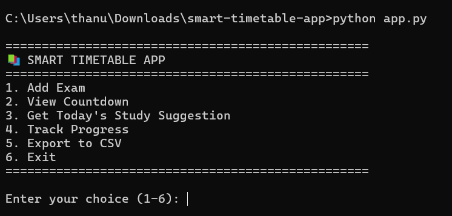
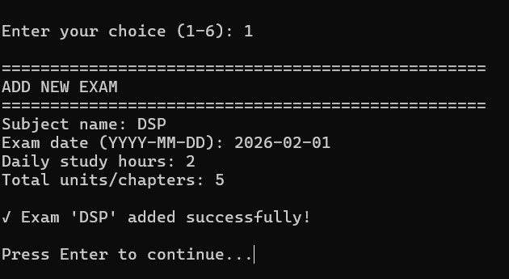
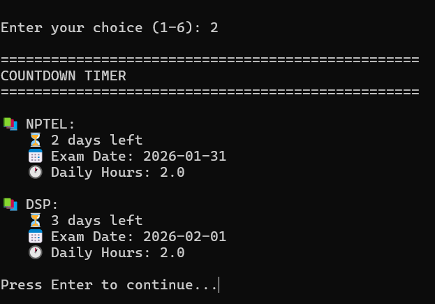
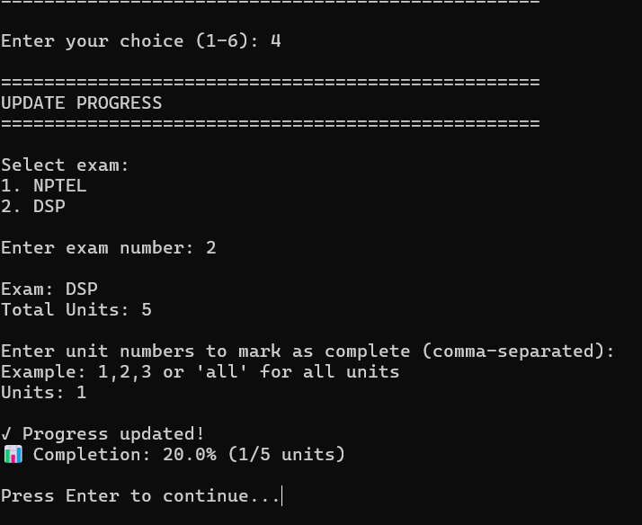
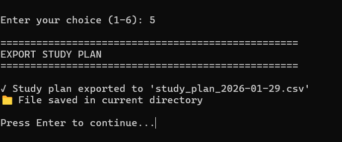

# IoT Transformer Health Monitoring
📌 Project Type: IoT + Embedded Systems + Python

An IoT-based embedded system for real-time monitoring of transformer parameters such as
temperature, load current, and voltage to prevent failures.

## System Overview

This project monitors transformer temperature and current using ESP32.
Faults are detected using threshold logic and alerts are generated.

## System Architecture

The IoT Transformer Health Monitoring system continuously monitors transformer parameters
such as temperature and load current to detect abnormal conditions and prevent failures.

## Key Components

- ESP32 microcontroller
- Temperature sensor
- Current sensor
- Alert / notification mechanism
- Monitoring dashboard or serial output

## Working Principle

1. Sensors collect transformer temperature and current values
2. ESP32 processes the sensor data
3. Threshold-based logic detects fault conditions
4. Alerts are generated when values exceed safe limits

--------------------------------------------------

# CLI Todo App (Python)

📁 Location: /todo-cli-app

A simple command-line to-do list application built using Python.

## Features
- Add new tasks
- List all tasks with completion status
- Mark tasks as done
- Delete tasks
- Tasks persist using a JSON file

## How to Run

```bash
cd todo-cli-app
python todo.py

# 📚 Smart Timetable App

A simple yet powerful timetable application that helps you plan your study schedule for exams.

## ✨ Features

1. **Add Exams** - Add your exams with subject, date, and study hours
2. **Countdown Timer** - See days remaining for each exam
3. **Daily Study Suggestion** - Get personalized study tasks for today
4. **Progress Tracking** - Track completion percentage for each subject
5. **Export to CSV** - Export your study plan for offline use

## 📸 Screenshots

### 1. Main Menu


### 2. Adding an Exam


### 3. Countdown Timer  


### 4. Progress Tracking


### 5. CSV Export



## 🚀 Getting Started

### Prerequisites
- Python 3.6 or higher

### Installation
```bash
# Clone the repository
git clone https://github.com/yourusername/smart-timetable-app.git

# Navigate to the project directory
cd smart-timetable-app

# No installation required! Python has all built-in modules
>>>>>>> timetable/main
